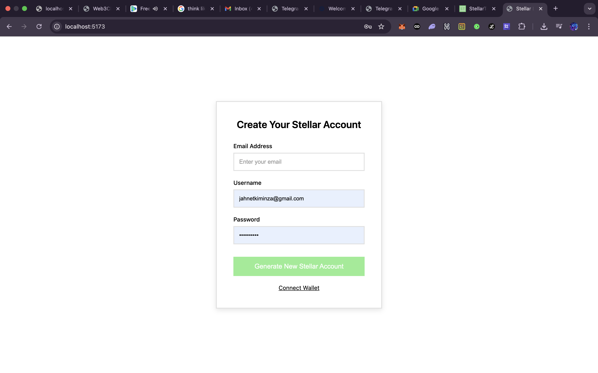
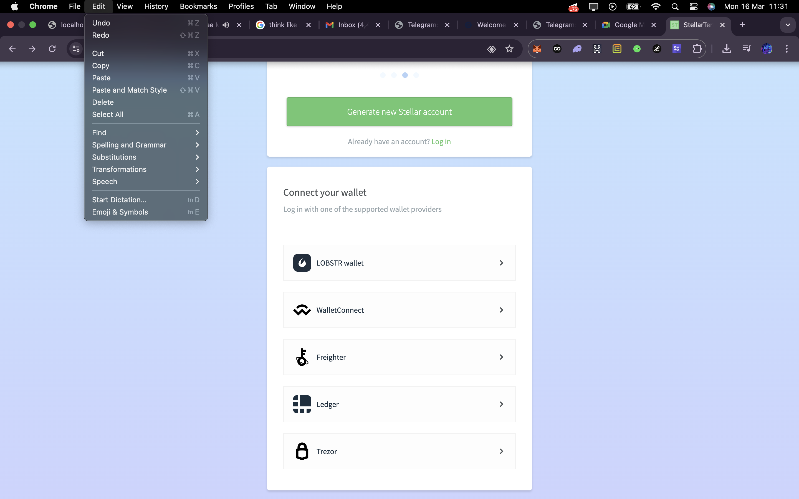

# Stellar BELT-2 dApp Submission

## Errors Encountered
- SSL certificate issues during contract deployment
- Network connectivity problems with Stellar testnet
- Module detection challenges with Stellar Wallets Kit v2.0.1
- WASM compilation target configuration requirements

## Contract Address
CACC6ZI2U3BOUIBJURYBIT7PY4HXFINMFPJCUV6WDZEEP6QEJ7CJZFCY

## Application Screenshots

### Before Connect Wallet


### After Wallet Connection - Multiple Wallet Options


---

# Stellar Soroban dApp - Level 2

A comprehensive decentralized application built on Stellar blockchain with multi-wallet support and smart contract integration.

## Architecture Overview

```
┌─────────────────────────────────────────────────────────────────┐
│                        FRONTEND LAYER                          │
├─────────────────────────────────────────────────────────────────┤
│  React 19.2.4 + Vite 8.0.0                                     │
│  ┌─────────────┐ ┌─────────────┐ ┌─────────────┐ ┌───────────┐ │
│  │ WalletConnect│ │   Balance   │ │ SendPayment │ │ContractUI │ │
│  │   Component │ │  Component  │ │ Component  │ │ Component │ │
│  └─────────────┘ └─────────────┘ └─────────────┘ └───────────┘ │
│         │               │               │               │       │
│         └───────────────┼───────────────┼───────────────┘       │
│                         │                                       │
│  ┌─────────────────────────────────────────────────────────┐     │
│  │              useWallet Hook                             │     │
│  │  ┌─────────────────────────────────────────────────────┐ │     │
│  │  │ StellarWalletsKit v2.0.1 (Multi-Wallet Support)    │ │     │
│  │  │ • Freighter • xBull • Albedo • Hana • Lobstr       │ │     │
│  │  │ • WalletConnect • Trezor • Ledger • Rabet          │ │     │
│  │  └─────────────────────────────────────────────────────┘ │     │
│  └─────────────────────────────────────────────────────────┘     │
└─────────────────────────────────────────────────────────────────┘
                                │
                                ▼
┌─────────────────────────────────────────────────────────────────┐
│                    STELLAR NETWORK LAYER                      │
├─────────────────────────────────────────────────────────────────┤
│  Stellar SDK v13.3.0                                           │
│  ┌─────────────────────────────────────────────────────────┐     │
│  │               Stellar RPC Interface                     │     │
│  │  • Account Balance Queries                              │     │
│  │  • Transaction Submission                               │     │
│  │  • Contract Invocation                                  │     │
│  │  • Transaction Simulation                              │     │
│  └─────────────────────────────────────────────────────────┘     │
│                                │                               │
│                                ▼                               │
│  ┌─────────────────────────────────────────────────────────┐     │
│  │              Soroban Smart Contract                      │     │
│  │  ┌─────────────┐ ┌─────────────┐ ┌─────────────────┐   │     │
│  │  │   Counter   │ │   Message   │ │   Storage       │   │     │
│  │  │  Functions  │ │  Functions  │ │   Management    │   │     │
│  │  └─────────────┘ └─────────────┘ └─────────────────┘   │     │
│  └─────────────────────────────────────────────────────────┘     │
└─────────────────────────────────────────────────────────────────┘
```

## Project Structure

```
belt2/
├── README.md                    # Project documentation
├── package.json                 # Dependencies & scripts
├── index.html                   # HTML entry point
├── src/                         # Source code
│   ├── main.jsx                 # React app entry
│   ├── App.jsx                  # Main application component
│   ├── App.css                  # Application styling
│   ├── index.css                # Global styles & reset
│   ├── hooks/                   # Custom React hooks
│   │   └── useWallet.js         # Wallet management hook
│   ├── components/               # React components
│   │   ├── WalletConnect.jsx    # Wallet connection UI
│   │   ├── Balance.jsx          # XLM balance display
│   │   ├── SendPayment.jsx      # Payment sending UI
│   │   └── ContractPanel.jsx    # Contract interaction UI
│   └── utils/                   # Utility functions
│       ├── stellar.js           # Stellar SDK integration
│       └── errors.js            # Error handling utilities
├── public/                      # Static assets
│   ├── favicon.ico              # App favicon
│   └── stellar-logo.png         # Stellar branding
├── contracts/                   # Smart contracts (empty)
└── stellar-contract/            # Soroban contract project
    ├── Cargo.toml               # Workspace configuration
    ├── README.md                # Contract documentation
    └── contracts/               # Contract source
        └── hello-world/         # Main contract
            ├── Cargo.toml       # Contract dependencies
            ├── Makefile          # Build utilities
            └── src/             # Contract source code
                ├── lib.rs        # Contract implementation
                └── test.rs       # Contract tests
```

## Features

### Multi-Wallet Support
- **Freighter** - Browser extension wallet
- **xBull** - Desktop/mobile wallet
- **Albedo** - Web-based wallet
- **Hana** - Mobile wallet
- **Lobstr** - Mobile wallet
- **WalletConnect** - Protocol support
- **Trezor** - Hardware wallet
- **Ledger** - Hardware wallet
- **Rabet** - Browser extension

### Wallet Functionality
- **Connect/Disconnect** wallets
- **View XLM balance** in real-time
- **Send XLM payments** to any address
- **Transaction signing** with proper error handling

### Smart Contract Integration
- **Counter Contract** - Increment/decrement functionality
- **Message Storage** - Set and retrieve string messages
- **Event Publishing** - Contract event emissions
- **State Management** - Persistent data storage

### User Interface
- **Dark Theme** - Modern dark mode design
- **Card-based Layout** - Clean component organization
- **Responsive Design** - Mobile-friendly interface
- **Real-time Updates** - Live transaction status
- **Error Handling** - User-friendly error messages

## Technology Stack

### Frontend
- **React 19.2.4** - UI framework
- **Vite 8.0.0** - Build tool and dev server
- **Stellar Wallets Kit v2.0.1** - Multi-wallet integration
- **Stellar SDK v13.3.0** - Stellar blockchain interaction

### Smart Contract
- **Rust** - Contract programming language
- **Soroban SDK v21.0.0** - Stellar smart contract framework
- **WASM** - WebAssembly compilation target

### Development Tools
- **Stellar CLI v25.1.0** - Command-line tools
- **Rust Toolchain** - Latest stable Rust
- **wasm32-unknown-unknown** - WASM compilation target

## Installation & Setup

### Prerequisites
```bash
# Install Rust
curl --proto '=https' --tlsv1.2 -sSf https://sh.rustup.rs | sh

# Add WASM target
rustup target add wasm32-unknown-unknown

# Install Stellar CLI
cargo install --locked stellar-cli
```

### Frontend Setup
```bash
# Install dependencies
npm install

# Start development server
npm run dev

# Build for production
npm run build
```

### Contract Setup
```bash
# Navigate to contract directory
cd stellar-contract

# Build contract
stellar contract build

# Deploy to testnet
stellar contract deploy \
  --wasm target/wasm32v1-none/release/hello_world.wasm \
  --source deployer \
  --network testnet
```

## Configuration

### Network Configuration
- **Testnet Network** - Development and testing
- **RPC Endpoint** - `https://soroban-testnet.stellar.org`
- **Network Passphrase** - `Test SDF Network ; September 2015`

### Contract Configuration
- **Contract ID** - Set after deployment
- **Function Exports** - `increment`, `get_count`, `set_message`, `get_message`
- **Storage Keys** - `Counter`, `Message`

## Usage Instructions

### 1. Connect Wallet
1. Open application in browser
2. Click "Connect Wallet" button
3. Select preferred wallet from modal
4. Approve connection in wallet

### 2. View Balance
- Connected wallet's XLM balance displays automatically
- Updates in real-time after transactions

### 3. Send Payments
1. Enter recipient address
2. Enter amount in XLM
3. Click "Send Payment"
4. Confirm transaction in wallet

### 4. Contract Interaction
1. **Increment Counter** - Click "Increment" button
2. **Set Message** - Enter text and click "Set Message"
3. **Get Message** - Click "Get Message" to retrieve
4. **View Counter** - Current count displays automatically

## Testing

### Frontend Testing
```bash
# Run development server
npm run dev

# Open browser to http://localhost:5173
# Test wallet connection and contract interactions
```

### Contract Testing
```bash
# Navigate to contract directory
cd stellar-contract/contracts/hello-world

# Run contract tests
cargo test

# Build contract
stellar contract build
```

## Contract API Reference

### Functions

#### `increment() -> u32`
- **Purpose:** Increment counter by 1
- **Returns:** New counter value
- **Events:** Publishes "INC" event with new value

#### `get_count() -> u32`
- **Purpose:** Get current counter value
- **Returns:** Current counter value (0 if not set)

#### `set_message(message: String)`
- **Purpose:** Store a message string
- **Parameters:** `message` - String to store
- **Events:** Publishes "MSG" event with message

#### `get_message() -> String`
- **Purpose:** Retrieve stored message
- **Returns:** Stored message or default "Hello, Stellar!"

### Storage Structure
```
DataKey::Counter -> u32
DataKey::Message -> String
```

## Security Considerations

### Frontend Security
- **Input Validation** - All user inputs validated
- **Error Handling** - Comprehensive error catching
- **Secure Connections** - HTTPS only in production

### Contract Security
- **Access Control** - Public functions with proper validation
- **Overflow Protection** - Safe arithmetic operations
- **Event Logging** - All state changes emit events

### Wallet Security
- **Transaction Signing** - Never exposes private keys
- **User Confirmation** - All transactions require wallet approval
- **Network Isolation** - Testnet only for development

## Troubleshooting

### Common Issues

#### Wallet Connection Failed
- Check wallet is installed and unlocked
- Ensure browser supports wallet extensions
- Verify network is set to Testnet

#### Transaction Errors
- Check account has sufficient XLM balance
- Verify recipient address is valid
- Ensure network connectivity

#### Contract Deployment Failed
- Check deployer account is funded
- Verify contract WASM is built correctly
- Ensure network configuration is correct

### Debug Tools
- **Browser Console** - Check for JavaScript errors
- **Stellar Laboratory** - Advanced debugging tools
- **Network Explorer** - View transaction details

## Additional Resources

### Documentation
- [Stellar Developers](https://developers.stellar.org/)
- [Soroban Documentation](https://developers.stellar.org/docs/build/smart-contracts/)
- [Stellar Wallets Kit](https://github.com/creit-tech/stellar-wallets-kit)

### Tools
- [Stellar Laboratory](https://laboratory.stellar.org/)
- [Stellar Expert](https://stellar.expert/)
- [Stellar Quest](https://stellar.quest/)

### Community
- [Stellar Discord](https://discord.gg/stellar)
- [Stellar Reddit](https://reddit.com/r/Stellar)
- [Stack Overflow](https://stackoverflow.com/questions/tagged/stellar)

## License

This project is licensed under the MIT License - see the LICENSE file for details.

## Contributing

1. Fork the repository
2. Create feature branch
3. Commit changes
4. Push to branch
5. Open Pull Request

## Support

For support and questions:
- Create an issue in the repository
- Join the Stellar Discord community
- Check the troubleshooting section above

---

**Built with love for the Stellar ecosystem**
